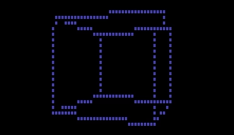

# CubeFN
*The cube-from-nothing.*

An experimental demo that renders a true-3D spinning wireframe cube directly on bare x86 hardware. No OS, no third-party libraries.

## Build
This project is written on Assembly using [FASM](https://flatassembler.net/).
Test it in QEMU or Bochs.

This repo has some Windows cmd scripts which build and run the demo: `run_qemu.bat`, `run_bochs.bat`.